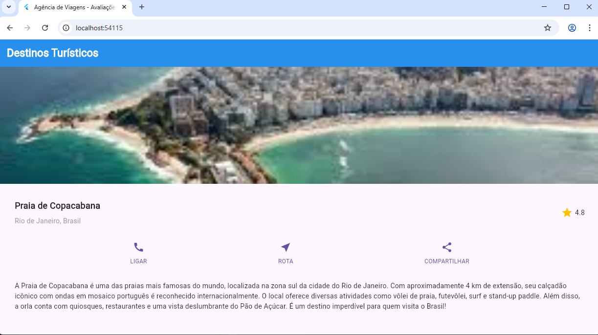

# Flutter Travel App - Agencia de Viagens

Aplicativo movel desenvolvido em Flutter para avaliacao de destinos turisticos, criado como trabalho pratico da disciplina **dgt2812 - Desenvolvimento de Aplicativos Moveis com Flutter**.

## Sobre o Projeto

Este aplicativo foi desenvolvido para uma agencia de viagens ficticia que deseja compartilhar avaliacoes e comentarios sobre experiencias de viagem. O app utiliza widgets interativos do Flutter para exibir informacoes sobre destinos turisticos de forma envolvente e responsiva.

### Funcionalidades

- Exibicao de imagem do destino turistico
- Secao de titulo com nome do local e avaliacao com estrelas
- Botoes de acao funcionais (Ligar, Rota, Compartilhar)
- Descricao detalhada do destino
- Interface responsiva com suporte a scroll (ListView)
- Design moderno utilizando Material Design 3

### Botoes de Acao

| Botao | Funcionalidade |
|-------|----------------|
| **LIGAR** | Abre o discador do telefone com numero pre-configurado |
| **ROTA** | Abre o Google Maps com a localizacao do destino |
| **COMPARTILHAR** | Abre o menu de compartilhamento do sistema |

## Tecnologias Utilizadas

- **Flutter** - Framework de desenvolvimento multiplataforma
- **Dart** - Linguagem de programacao
- **Material Design 3** - Sistema de design do Google
- **url_launcher** - Package para abrir URLs, telefone e mapas
- **share_plus** - Package para compartilhamento nativo

## Estrutura do Projeto

```
dgt2812/
├── lib/
│   └── main.dart              # Codigo principal do aplicativo
├── images/
│   ├── copacabana.jpg         # Imagem do destino turistico
│   └── visualização.png       # Screenshot da interface
├── pubspec.yaml               # Configuracoes e dependencias do projeto
└── README.md                  # Documentacao do projeto
```

## Como Executar

### Pre-requisitos

- Flutter SDK instalado (versao 3.0.0 ou superior)
- Dart SDK
- Editor de codigo (VS Code, Android Studio, etc.)
- Navegador Chrome (para execucao web)

### Passos para Execucao

1. **Clone o repositorio:**
```bash
git clone https://github.com/Rjudsxz97-cpu/dgt2812.git
cd dgt2812
```

2. **Instale as dependencias:**
```bash
flutter pub get
```

3. **Execute o aplicativo no Chrome:**
```bash
flutter run -d chrome
```

## Interface do Aplicativo

A imagem abaixo mostra a interface completa do aplicativo:



### Caminho da imagem para apresentacao:
```
images/visualização.png
```

O aplicativo apresenta:
- Uma imagem de destaque do destino turistico (Praia de Copacabana)
- Titulo com o nome do local e sua localizacao
- Sistema de avaliacao com estrelas (4.8)
- Botoes de acao interativos para interacao
- Texto descritivo sobre o destino

## Conceitos Aplicados

### Widgets Utilizados

| Widget | Descricao |
|--------|-----------|
| `MaterialApp` | Widget raiz que configura o tema e navegacao |
| `Scaffold` | Estrutura basica da tela com AppBar e body |
| `ListView` | Lista com scroll para organizar elementos |
| `Container` | Widget para espacamento e estilizacao |
| `Row` | Organizacao horizontal de widgets |
| `Column` | Organizacao vertical de widgets |
| `Expanded` | Expande widget para ocupar espaco disponivel |
| `Image.asset` | Exibicao de imagens locais |
| `Icon` | Icones do Material Design |
| `Text` | Exibicao de texto estilizado |
| `InkWell` | Widget para detectar toques com efeito visual |

### Packages Externos

| Package | Uso |
|---------|-----|
| `url_launcher` | Abrir URLs externas, fazer ligacoes e abrir mapas |
| `share_plus` | Compartilhar conteudo usando o menu nativo do sistema |

### Boas Praticas Implementadas

- **Abordagem "de baixo para cima"**: Construcao progressiva dos elementos
- **Codigo organizado**: Separacao de secoes em variaveis distintas
- **Responsividade**: Uso de ListView para suporte a diferentes tamanhos de tela
- **Reutilizacao**: Metodo auxiliar para construcao de botoes
- **Funcionalidade real**: Botoes com acoes funcionais

## Autor

**Judson Felipe da silva**
- Disciplina: dgt2812 - Desenvolvimento de Aplicativos Moveis com Flutter
- Instituicao: Polo planalto - Natal-RN

## Licenca

Este projeto foi desenvolvido para fins educacionais como parte do trabalho pratico da disciplina dgt2812.
